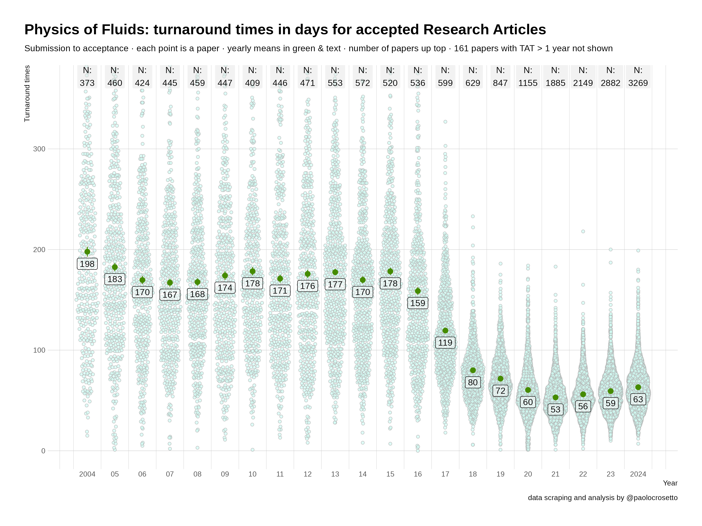

# Scraping "Physics of Fluids" for turnaround times

Howto and R code to scrape the journal "Physics of Fluids" for bibliometric data.

### Dependencies

You will need `tidyverse`, `rvest` and `htttr` for the scrape; some extra packages like `gt`, `gtExtras`, `ggbeeswarm` and `hrbrthemes` for the plots and tables.

## How to

You proceed in three steps

1.  run `Scripts/scrape_links.R` – this retrieves for each volume and issue a list of links to all articles. This can take up to some hours.

2.  run `Scripts/scrape_articles.R` – this goes over the list of links and for each link retrieves authors, title, turnaround times. This can take up to some weeks, depending on how many issues you want to scrape.

3.  run the Analysis.R – this supposes you've scraped the data first. It generates the plots and tables you see in the `Output` folder.

## Data availability

I do not share the actual data that result from the scrape in this repository,a s this is not generally allowed for scraping – one is free to scrape, and then to analyse the data, but not free to redistribute publicly the scraped data, or at least not in general. So you won't be able to reproduce the analysis without doing your scrape first, sorry!
